# Microsoft Administration for EDU

**DOCUMENTAZIONE:“Microsoft 365 Administration for Edu”**

**Corso di “Sicurezza nelle Reti e nei Sistemi Distribuiti”** <br>
**Anno Accademico 2021/2022**

**Garbarro Roberto** 

**Casulli Sara**

**Annese Francesca**


## Indice
1. [Obiettivo](#Obiettivo)
2. [Requisiti](#requisiti)
3. [Installazione](#3-installazione)
4. [Concetti generali](#concetti-generali)
5. [Funzionamento](#funzionamento) 
6. [Menù](#menù)

   2. [Studenti](#studenti)
      1. Gestione Studenti
      1. Aggiungi più studenti
   2. [Docenti](#docenti)
      1. Gestione Docenti
      1. Aggiungi più docenti
   2. [Gruppi e teams](#gruppi-e-teams)
      1. Gestione Gruppi
      1. Gestione Gruppi Classe
   2. [Operazioni di inizio anno](#operazioni-di-inizio-anno)
      1. Passaggio di classe
      1. Creazione Team Didattici


<a id="Obiettivo"></a>
	  
## 1. Obiettivo

Per individuare l'obiettivo del programma realizzato si è partiti dal contesto e si è identificato il problema.

***Problema***:  L'interfaccia del pannello di amministrazione di Microsoft 365 non è adatta per chi ha il compito di gestirlo all’interno di un ambiente scolastico. 

***Soluzione e obiettivo***: Creazione di un tool grafico che permette facilmente operazioni per le scuole, che sia quindi user friendly, in modo da poter eseguire alcune operazioni automaticamente.                                             
Quindi l’***obiettivo*** è quello di realizzare una dashboard personalizzata per l’amministrazione di Microsoft 365, ponendo attenzione al mondo EDU. <br> <br>


Le principali interfacce a cui l'utente può accedere sono:

- Gestione studenti
- Aggiunta di più studenti
- Gestione docenti
- Aggiunta di più docenti
- Gestione gruppi
- Gestione gruppi classe
- Promozione studenti
- Creazione team didattici

Il funzionamento dell'applicazione è incentrato sulla creazione di istruzioni Powershell ad hoc in base alle richieste dell'utente, all'esecuzione di tali istruzioni ed alla visualizzazione dei risultati.

<a id="requisiti"></a>
## 2. Requisiti
- **Java** SE Development kit (13 o successive): <https://www.oracle.com/java/technologies/javase/jdk13-archive-downloads.html>

- **PowerShell** con i seguenti moduli installati:
```
 	Msolservice
 	MicrosoftTeams
	PowerShellGet
 	AzureAD
 ```

 <a id="installazione"></a>

 ## 3. Installazione


Per installare l'applicazione con tutti i requisiti necessari, è sufficiente eseguire il file "**setup.exe**" con i diritti di amministrazione.<br>                      Il setup eseguirà le seguenti istruzioni: <br>

 - Installazione dei moduli di Powershell
 - Creazione di una cartella Microsoft365forEdu nella cartella Documenti dell'utente corrente
 - Copia di tutti i file del programma all'interno di tale cartella
 - Creazione di un file sul desktop *“Microsoft 365 Administrator for Edu”* per l'esecuzione rapida dell'applicazione
 - Verifica della presenza di java sulla macchina. Se java non è presente, il programma avvierà l'installazione di java 13.

 > NOTA:
 Se è presente già una versione di java installata, il programma di installazione mostrerà la versione attuale di java. È compito dell'utente verificare se la versione corrente è la 13 o una più recente oppure provvedere manualmente all'installazione di una versione di java compatibile con l'applicazione.
 
Se l'utente preferisce installare manualmente i moduli di powershell richiesti, può eseguire Powershell con i diritti di amministrazione ed eseguire lo script presente nel file *install.ps1*.


<a id="concetti-generali"></a>

## 4. Concetti generali

Si descrivono le tipologie di oggetti adoperati dal programma:

Uno **STUDENTE** è composto dai seguenti campi:

- **Nome**
- **Cognome**
- **Email istituzionale** : È necessario scegliere un dominio per l’email, tra quelli legati al tenant.
- **Scuola**
- **Classe**: Una classe per essere valida deve essere formata da un carattere numerico e da almeno una sequenza di lettere. (Esempio: 1A – 2BIO – 3CI)<br>


Un **DOCENTE** è composto dai seguenti campi:

- **Nome**
- **Cognome**
- **Email istituzionale** : È necessario scegliere un dominio per l’email, tra quelli legati al tenant.
- **Materie**: Le materie possono essere anche più di una. Quando verranno inserite devono essere separate da virgola (Esempio: chimica,matematica,inglese).<br>


Un **GRUPPO** è composto dai seguenti campi:

- **Nome gruppo**
- **Descrizione** 
- **Email istituzionale** : È necessario scegliere un dominio per l’email, tra quelli legati al tenant.  <br>


Un **GRUPPO CLASSE** è un gruppo avente nel nome la dicitura “*gruppo classe*”; è composto dai seguenti campi:

- **Classe** : Una classe per essere valida deve essere formata da un carattere numerico e da almeno una sequenza di lettere. (Esempio: 1A – 2BIO – 3CI)
- **Scuola** <br>


Un **TEAM DIDATTICO** è composto dai seguenti campi:
- **Materia**
- **Docente**
- **Gruppo Classe**<br>
Il team didattico, oltre ad essere un gruppo, è fisicamente un team di Microsoft Teams.<br>


<a id="funzionamento"></a>
## 4. Funzionamento

### Connessione:
Per poter utilizzare i servizi messi a disposizione dall'applicazione, è necessario autenticarsi con email e password di un account che abbia privilegi amministrativi di Microsoft 365.<br>
La connessione può avvenire in due modi:

- **Autenticazione classica**, disponibile soltanto se non è impostata l'autenticazione MFA, consente di poter effettuare agilmente l'accesso con email e password. È necessario compilare i due campi e successivamente cliccare sul pulsante “**Connetti**”. Dopo qualche secondo, se le credenziali sono corrette, avverrà l'autenticazione sui tre moduli.<br>

<p align="center">
     <br></p>

- **Autenticazione con MFA**, consente l’autenticazione a più fattori (MFA: Multi Factor Authentication) premendo sul pulsante “**Connetti con MFA**”. L'autenticazione avverrà per tre volte (una per ciascun modulo di powershell) attraverso una finestra di Microsoft in cui inserire le credenziali.<br>

<p align="center">
    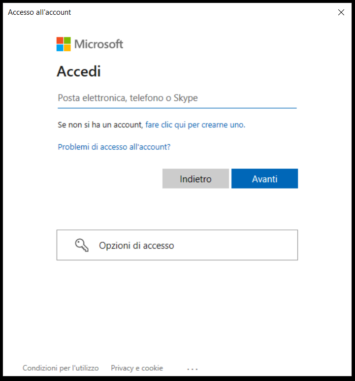 <br>

    
>NOTA: <br> 
Le credenziali inserite devono essere valide e corrette.<br>
I campi NON possono essere vuoti.<br>

Se uno di questi requisiti non è soddisfatto, verrà mostrato un messaggio di errore: <br>
<p align="center">
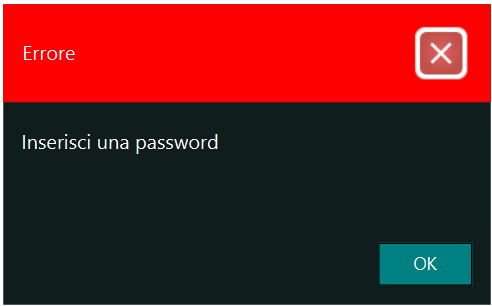 
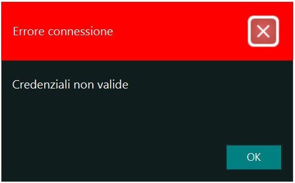 <br><br>

Subito dopo aver inserito mail e password, indipendentemente dal tipo di autenticazione che si è scelto di usare, bisogna attendere qualche secondo il caricamento della schermata principale, l'applicazione si sta connettendo ai tre moduli. Attraverso questa finestra è possibile vedere l’avanzamento del caricamento dei dati.<br>

<p align="center">
     <br>
	 
	
<a id="menù"></a>	
## 5. Menù

Una volta effettuata la connessione si aprirà automaticamente la schermata principale: il menù. Il menù controlla l'intera applicazione e deve rimanere aperto. La chiusura del menù implica la chiusura dell'applicazione.

La schermata del Menù mostra una serie di bottoni divisi in quattro aree:	
1. **Studenti** 
	- Gestione Studenti
	- Aggiungi più studenti <br>
2. **Docenti**
	- Gestione docenti
	- Aggiungi più docenti<br>
3. **Gruppi e teams**
	- Gestione Gruppi
	- Gestione gruppi classe<br>
4. **Operazioni di inizio anno**
	- Passaggio di classe
	- Creazione Team Didattici <br>
	
<p align="center">
 <br>
	
Il pulsante “Ricarica dati”, se premuto, in qualsiasi momento, ci permette di ricaricare i dati dal pannello di Office. Tale pulsante va premuto qualora si riscontrino delle inconsistenze di dati, per riallineare i dati dell'applicazione con quelli di Office.

<a id="studenti"></a>
	
## ii. STUDENTI
	
### a. Gestione studenti: <br>
Questa funzione permette di visualizzare la lista degli studenti registrati e di compiere operazioni su di essi.            
<p align="center">
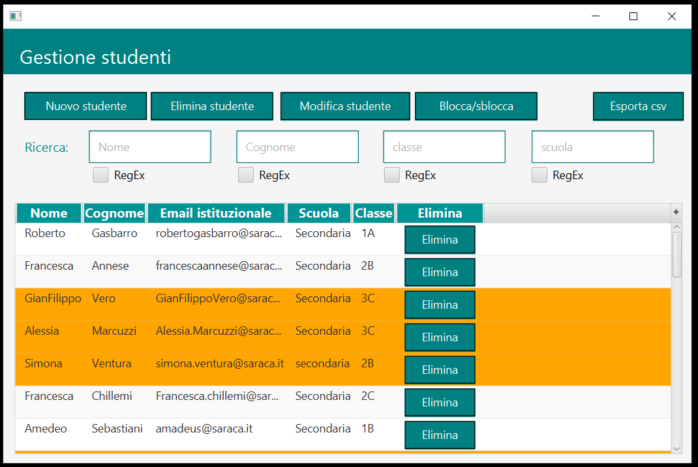 <br>
		
Si può effettuare una ricerca sugli studenti filtrando per nome, cognome, classe e scuola. <br>      
*Esempio* di ricerca filtrando per classe “A”: <br>
<p align="center">
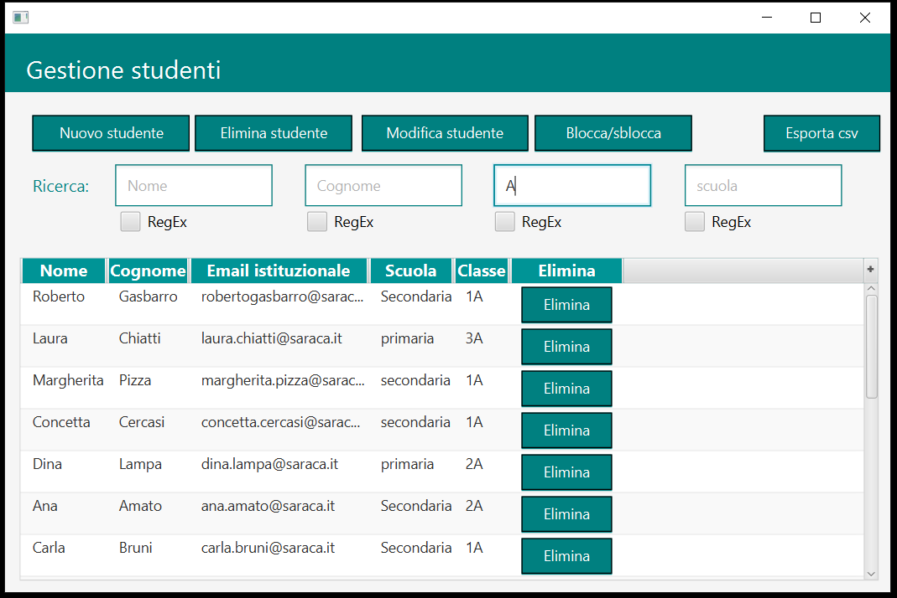 <br>

È inoltre possibile utilizzare le **espressioni regolari** per effettuare ricerche, ad esempio si vogliono cercare le classi 1 e 2 di tutte le sezioni.<br>
Per farlo, si deve spuntare la voce “**RegEx**” in corrispondenza del campo *Classe* e scrivere al suo interno l’espressione regolare che sarà la seguente: **[1-2][A-Z]**<br>

>NOTE: <br> 
È possibile consultare l'utilizzo delle espressioni regolari su <a href="https://docs.microsoft.com/it-it/dotnet/standard/base-types/regular-expression-language-quick-reference">questa pagina</a><br>


<p align="center">
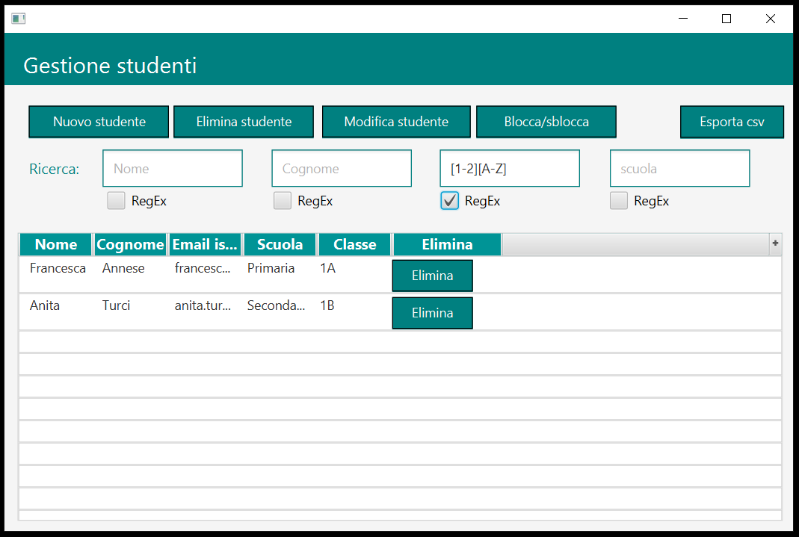 <br>
	
Si può anche modificare la visualizzazione della tabella, scegliendo di visionare solo alcune colonne e nascondendo le altre.    <br>
<p align="center">
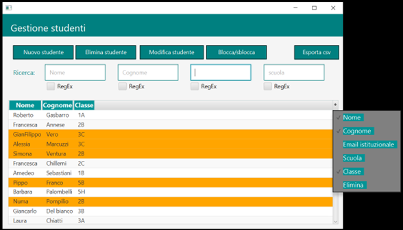 <br><br>
	

Nella schermata “**gestione studenti**” sono presenti una serie di pulsanti che mi permettono di compiere varie operazioni.    <br>
	
### Nuovo studente <br>

Si può aggiungere un nuovo studente cliccando sul pulsante “**Nuovo studente**” ed inserendo i dati richiesti, quali *nome*, *cognome* ed *email istituzionale*, scegliendo uno dei domini associati al tenant. Inoltre è possibile inserire lo studente in un *gruppo classe*, selezionandolo dal menù a tendina. I campi *scuola* e *classe* saranno automaticamente compilati in base al gruppo classe scelto.

Si può anche assegnare allo studente una *licenza* fra quelle disponibili (In questo caso: 01hc5:DEVELOPERPACK\_E5).<br>

>NOTE: <br> 
È possibile consultare la corrispondenza tra i nomi dei prodotti e gli identificatori delle licenze su <a href="https://docs.microsoft.com/it-it/azure/active-directory/enterprise-users/licensing-service-plan-reference">questa pagina</a><br>

Una volta salvato, lo studente appena inserito sarà aggiunto alla lista degli studenti.	<br>
	
<p align="center">
 <br><br>


Cliccando sul pulsante “Salva” apparirà la schermata di conferma dell’avvenuto inserimento dello studente e mostrerà la password assegnata ad esso, all'account appena creato: <br>
		
<p align="center">
 <br><br>
	
>NOTE: <br> 
È necessario scegliere un dominio per l’email, perché possono esserci più domini legati al tenant.<br>
Non possono essere inseriti due utenti con stesso indirizzo email. <br>
Il nome dello studente deve avere una lunghezza di almeno 2 caratteri. <br>
Il cognome dello studente deve avere una lunghezza di almeno 2 caratteri. <br>

Se uno di questi requisiti non è soddisfatto, verrà mostrato un messaggio di errore: <br>
<p align="center">
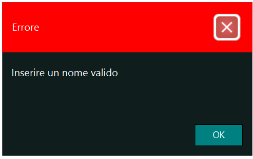 
 
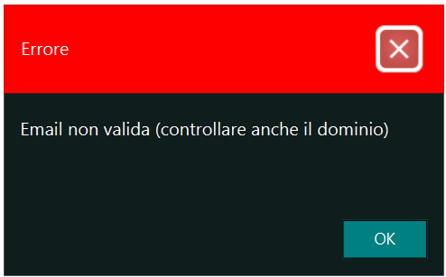 <br><br>
	

### Elimina studente <br>
Si può eliminare uno studente selezionando la riga e cliccando sul pulsante “**Elimina studente**”, a questo punto non  resta che confermare la volontà di eliminare uno studente, attraverso il riquadro di “*Conferma rimozione*”. <br>
	<p align="center">
 <br>
		
### Modifica studente <br>
Selezionando la riga di uno studente e premendo il pulsante **Modifica studente**, è possibile modificare i dati relativi allo studente. 
<p align="center">
 <br></p>

Premendo il pulsante **Reset Password** è possibile reimpostare una nuova password. Dopo l’avvenuta conferma verrà assegnata una nuova password randomica allo studente.

<p align="center">
 
</p> <br>
		
### Blocca/Sblocca studente <br>

Selezionare la riga dello studente che si vuole *bloccare* e cliccare sul pulsante “**Blocca studente**”. <br>
Tutti gli studenti bloccati sono evidenziati in arancione.<br>
	<p align="center">
 
 <br>

Dopo aver premuto sul pulsante sarà necessario confermare la volontà di bloccare lo studente selezionato:
<p align="center">
 <br>
			
Selezionare la riga dello studente evidenziata in giallo che si vuole *sbloccare* e cliccare sul pulsante “**Sblocca studente**”. <br>
<p align="center">
 
 <br>

Dopo aver premuto sul pulsante sarà necessario confermare la volontà di sbloccare lo studente selezionato: <br>
	<p align="center">
 <br>
		
		
### Esporta csv<br>
Cliccando sul pulsante “**Esporta csv**”, è possibile esportare la lista degli studenti con i relativi dati e salvarla in locale. Gli studenti esportati nel file sono quelli risultanti da un'eventuale ricerca<br>

Il file csv chiamato “export\_studenti.csv” sarà composto dai seguenti campi separati da virgola: Office,Department,IsBlockCredential,FirstName,DisplayName,License,Title,UserPrincipalName,LastName. <br>
		
### b. Aggiungi più studenti: <br>
Questa funzione permette di aggiungere più studenti contemporaneamente. <br>
		
<p align="center">
 <br>
	
Attraverso il pulsante “**Seleziona csv**” è possibile selezionare un csv già presente in locale ed aggiungere gli studenti e i relativi dati presenti all’interno del file. Il file deve essere nel formato “\*.csv” e deve contenere i seguenti campi: *UserPrincipalName,FirstName,LastName,DisplayName,Title,Departement,Office.* Si è scelta questa formattazione per rendere l'applicazione compatibile con i file estratti dalla maggior parte dei Registri Elettronici<br>
	
Se nella lista ci fosse qualche studente già registrato, comparirebbe evidenziato di colore arancione.<br>
	
Dopo la selezione del file csv, il sistema tenta di assegnare un gruppo classe esistente all'utente, in modo che sia automaticamente aggiunto a quel gruppo. Il gruppo classe può essere modificato attraverso il menù a tendina **Gruppo classe**.<br>

È possibile scegliere una licenza associare, alla voce **Licenza**, attraverso un menù tendina che, di default, suggerisce la prima licenza disponibile.<br>
>NOTE: <br> 
È possibile consultare la corrispondenza tra i nomi dei prodotti e gli identificatori delle licenze su <a href="https://docs.microsoft.com/it-it/azure/active-directory/enterprise-users/licensing-service-plan-reference">questa pagina</a><br>

Se alla lista degli studenti importati se ne vogliono aggiungerne altri, è possibile inserirli a mano compilando i campi richiesti: *nome*, *cognome*, *email* *istituzionale*, *scuola* e *classe*, e al termine premere sul pulsante **Nuovo**.<br>

È possibile impostare automaticamente la stessa password per tutti gli studenti.<br> Questa opzione è possibile spuntando la voce **Stessa password per tutti** e scegliendo una password.<br>
Altrimenti, a tutti gli studenti verrà assegnata una password random.

A questo punto premere il pulsante “**Conferma e importa**”. Notiamo tramite la colonna **Stato**, come gli studenti vengono importati e configurati uno alla volta.<br>
Al termine dell'operazione, verrà chiesto se si desidera o meno salvare le credenziali degli utenti. In caso affermativo, verranno salvate le credenziali in un file csv, nella posizione indicata dall'utente.<br>


<a id="docenti"></a>

## ii. DOCENTI
### a. Gestione docenti: <br>
Questa funzione, proprio come Gestione studenti, permette di visualizzare la lista dei docenti e di compiere operazioni su di essa al suo interno.       
<p align="center">
 <br></p>
		
Si può effettuare una ricerca sui docenti filtrando per nome, cognome, materie. È possibile utilizzare delle espressioni regolari per effettuare la ricerca.<br>
*Esempio* di ricerca filtrando per materia “matematica”:<br>
>NOTE: <br> 
È possibile consultare l'utilizzo delle espressioni regolari su <a href="https://docs.microsoft.com/it-it/dotnet/standard/base-types/regular-expression-language-quick-reference">questa pagina</a><br>
    
<p align="center">
 <br></p>
	
È possibile anche modificare la visualizzazione della tabella, scegliendo di visionare solo alcune colonne e nascondendo le altre.<br>
<p align="center">
 <br>
	
Nella schermata “**gestione docenti**” sono presenti una serie di pulsanti che permettono di compiere varie operazioni. <br>
	
### Nuovo docente <br>

Si può aggiungere un nuovo docente cliccando sul pulsante **Nuovo docente**. e compilando i campi richiesti, quali *nome*, *cognome* ed *email istituzionale*, scegliendo il dominio tra quelli mostrati nel menù a tendina. Opzionalmente, si può indicare, nel campo *materie*, la lista delle materie insegnate (separate da virgola. Esempio: matematica,fisica,inglese).<br>                                                                                
Si può anche assegnare al docente una *licenza* fra quelle disponibili (In questo caso: 01hc5:DEVELOPERPACK\_E5).<br>
>NOTE: <br> 
È possibile consultare la corrispondenza tra i nomi dei prodotti e gli identificatori delle licenze su <a href="https://docs.microsoft.com/it-it/azure/active-directory/enterprise-users/licensing-service-plan-reference">questa pagina</a><br>

Una volta salvato, il docente sarà aggiunto alla lista dei docenti.<br>
	<p align="center">
 <br>
		
Cliccando sul pulsante “Salva” apparirà la schermata di conferma dell’avvenuto inserimento del docente e mostrerà la password assegnata ad esso, all'account appena creato: <br>
		
<p align="center">
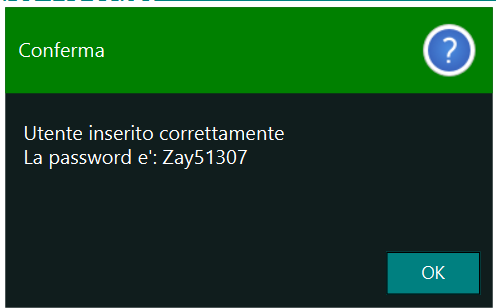 <br>
	
>NOTE: <br> 
È necessario scegliere un dominio per l’email, perché possono esserci più domini legati al tenant.<br>
Non possono essere inseriti utenti con stesso indirizzo email. <br>
Il nome del docente deve avere una lunghezza di almeno 2 caratteri. <br>
Il cognome del docente deve avere una lunghezza di almeno 2 caratteri. <br>

Se uno di questi requisiti non è soddisfatto, verrà mostrato un messaggio di errore: <br>
<p align="center">
 
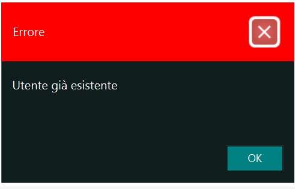
<br>
</p>
	

### Elimina docente <br>
Si può eliminare un docente selezionando la riga e cliccando sul pulsante “**Elimina docente**”, a questo punto non resta che confermare la volontà di eliminare un docente, attraverso il riquadro di “*Conferma rimozione*”. <br>
	<p align="center">
 <br>
Un altro modo per eliminare il docente è quello di premere sul pulsante “**Elimina**” nella colonna corrispondente al docente che si vuole eliminare.<br>

		
### Modifica docente <br>
Selezionando la riga di un docente e premendo il pulsante “**Modifica docente**”, si possono modificare i dati relativi al docente.<br>
Premendo il pulsante “**Reset Password**” è possibile reimpostare una nuova password. Dopo l’avvenuta conferma verrà assegnata una nuova password randomica al docente. <br>
	<p align="center">
 
 <br>
		
### Blocca/Sblocca docente <br>

Selezionare la riga del docente che si vuole *bloccare* e cliccare sul pulsante “**Blocca docente**”. <br>
Tutti i docenti bloccati sono evidenziati in giallo.<br>
	<p align="center">
 
 <br>

Dopo aver premuto sul pulsante sarà necessario confermare la volontà di bloccare il docente selezionato, attraverso questa finestra di avvertenza:
		<p align="center">
 <br>
			
Selezionare la riga del docente evidenziata in giallo che si vuole *sbloccare* e cliccare sul pulsante “**Sblocca docente**”. <br>
<p align="center">
 
 <br>

Dopo aver premuto sul pulsante sarà necessario confermare la volontà di sbloccare lo studente selezionato, attraverso questa finestra di avvertenza: <br>
	<p align="center">
 <br>
		
### Esporta csv<br>
Cliccando sul pulsante “**Esporta csv**”, si può esportare la lista dei con i relativi dati e salvarla in locale.<br>

Il file csv chiamato “export\_teachers.csv” sarà composto dai seguenti campi separati da virgola: *Department,IsBlockCredential,FirstName,DisplayName,License,Title,UserPrincipalName,LastName.* <br>
		
### b. Aggiungi più docenti: <br>
Questa funzione permette di aggiungere più docenti contemporaneamente. <br>
		
<p align="center">
 <br>
	
Questa funzionalità è analoga ad *Aggiungi più studenti*. <br>

Attraverso il pulsante “**Seleziona csv**” si può selezionare un csv già presente in locale ed aggiungere i docenti e i relativi dati presenti all’interno del file. Il file deve essere nel formato “\*.csv” e deve contenere i seguenti campi: *UserPrincipalName,LastName,DisplayName,Title,Departement.*<br>

Se nella lista ci fosse qualche docente già registrato, comparirebbe evidenziato di colore arancione.<br>
	
Si può scegliere quale licenza associare, alla voce **Licenza**, selezionandola dal menù tendina che suggerisce la prima licenza disponibile.<br>
>NOTE: <br> 
È possibile consultare la corrispondenza tra i nomi dei prodotti e gli identificatori delle licenze su <a href="https://docs.microsoft.com/it-it/azure/active-directory/enterprise-users/licensing-service-plan-reference">questa pagina</a><br>
	
È possibile inserire manualmente docenti per effettuare l'import, compilando i campi *nome*, *cognome*, *email* *istituzionale*, *materie*, e al termine premere sul pulsante “**Nuovo**”.<br>

È possibile impostare automaticamente la stessa password per tutti i docenti.<br> Questa opzione è possibile spuntando la voce “**Stessa password per tuti**” e scegliendo una password.<br>
Altrimenti, a tutti i docenti verrà assegnata una password random.

A questo punto premere il pulsante “**Conferma e importa**”. Notiamo tramite la colonna **Stato**, come i docenti vengono importati e configurati uno alla volta.<br>
Al termine dell'operazione, verrà chiesto se si desidera o meno salvare le credenziali degli utenti. In caso affermativo, le credenziali saranno salvate in un file csv in una cartella selezionata dall'utente.<br>

	
<a id="gruppi-e-teams"></a>
	
## IV. GRUPPI E TEAMS
### a. Gestione gruppi: <br>

Questa funzione permette di visualizzare la lista dei gruppi presenti e di compiere operazioni su di essa al suo interno. <br>                                          

I gruppi sono formati dal *nome* del gruppo, dalla *descrizione* e dalla *e-mail istituzionale*.<br>
	
All’interno dei gruppi sono presenti i *gruppi classe*, si distinguono dai gruppi perché il loro nome è preceduto dalla dicitura “*gruppo classe*”.<br>
<p align="center">
 <br></p>
	
Nella schermata “**Gestione gruppi**” sono presenti una serie di pulsanti che permettono di compiere varie operazioni. <br>
	
### Nuovo gruppo<br>
È possibile aggiungere un nuovo gruppo cliccando sul pulsante “**Nuovo gruppo**", e compilando tutti i campi richiesti, quali *nome gruppo*, *descrizione* e *indirizzo email*, scegliendo il dominio tra quelli presenti nel menù a tendina.<br>
Una volta salvato il gruppo appena inserito sarà aggiunto alla lista dei gruppi.<br>
<p align="center">
 <br>
	
>NOTE: <br> 
È necessario scegliere un dominio per l’email, perché possono esserci più domini legati al tenant.<br>
Non possono essere inseriti gruppi con stesso nickname. <br>
Il nome del gruppo deve avere una lunghezza di almeno 2 caratteri. <br>
La descrizione del gruppo deve avere una lunghezza di almeno 2 caratteri. <br>

Se uno di questi requisiti non è soddisfatto, verrà mostrato un messaggio di errore:<br>
<p align="center">
 
 <br>
	
### Visualizza componenti<br>
<p align="center">
 <br>

Selezionando un gruppo dalla lista e cliccando sul tasto “**Visualizza componenti**”, si possono visualizzare i **membri** di un gruppo con i relativi dati: *Nome*, *Cognome*, *E-mail* *istituzionale*, *Titolo* (Studente o Teacher).<br> 

È possibile eliminare un membro del gruppo cliccando sul pulsante “**Rimuovi**” della rispettiva riga del membro da eliminare.<br>

Oltre ai membri, si possono visualizzare anche i **proprietari** del gruppo.<br>
È possibile eliminare un proprietario del gruppo cliccando sul pulsante “**Rimuovi**” della rispettiva riga del proprietario da eliminare.<br>

Attraverso il pulsante “**Aggiungi**”, si può aggiungere un membro o un proprietario del gruppo.<br>
<p align="center">
<p> <br>
	
Per aggiungere un membro, è possibile cliccare sul pulsante **aggiungi**, selezionare la voce “**Aggiungi membri**” e selezionare dalla lista degli utenti quelli che si vogliono aggiungere al gruppo (in caso di selezione multipla, tenere premuto il tasto ctrl).<br>
Si può anche effettuare una ricerca per Nome o Cognome del membro da aggiungere al gruppo.<br>
<p align="center">
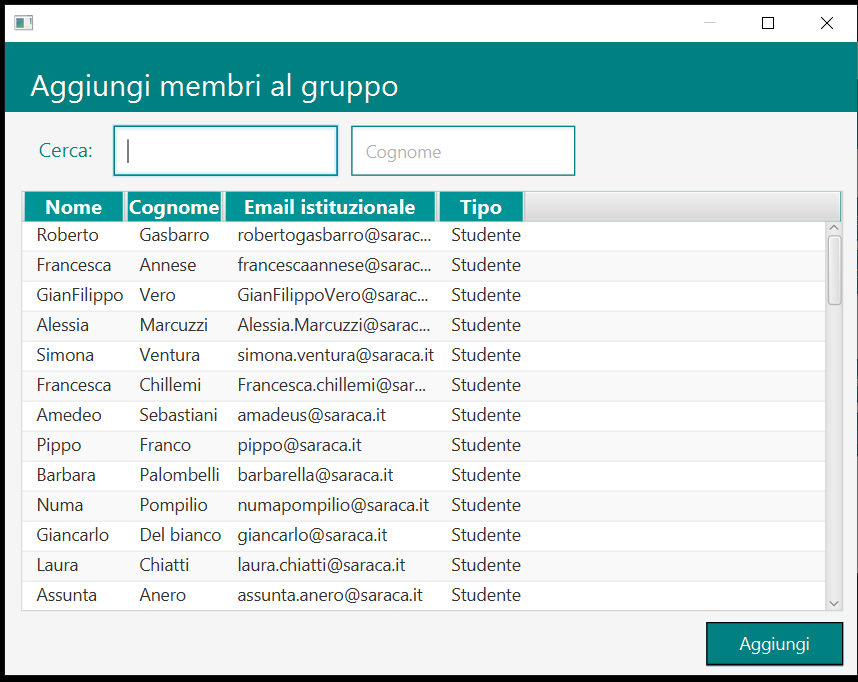 <br>
	
Cliccando sul pulsante “**Aggiungi**”, gli utenti selezionati diventano membri del gruppo.<br>

Per aggiungere un proprietario, è possibile cliccare sul pulsante **aggiungi**, selezionare la voce “**Aggiungi proprietari**” e selezionare dalla lista degli utenti quelli che si vogliono aggiungere al gruppo (in caso di selezione multipla, tenere premuto il tasto ctrl).<br>
Si può anche effettuare una ricerca per Nome o Cognome del proprietario da aggiungere al gruppo.<br>
<p align="center">
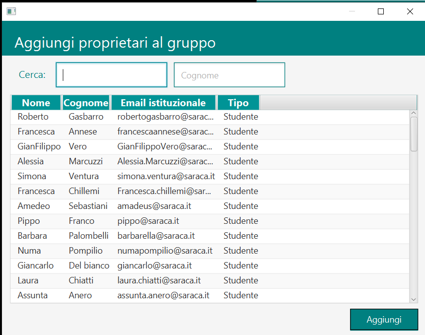 <br>
	
Cliccando sul pulsante “**Aggiungi**”, gli utenti selezionati diventano proprietari del gruppo.<br>
	
### Modifica gruppo<br>
Selezionando un gruppo dalla lista e cliccando sul tasto **Modifica gruppo**, si può modificare il campo *Nome* e/o il campo *Descrizione* del gruppo selezionato.<br>
	<p align="center">
 </p><br>
		
Cliccando sul pulsante “**Salva**”, il gruppo esistente sarà modificato con le modifiche apportate. 
	
### b. Gestione gruppi classe: <br>
Questa funzione permette di visualizzare la lista dei gruppi classe presenti. <br>
I gruppi classe permettono di effettuare operazioni complesse, che riguardano tutti gli studenti appartenenti allo stesso gruppo, come la creazione di un team didattico. <br>

Oltre alla visualizzazione della lista, è possibile aggiungere un nuovo gruppo classe compilando i campi *Classe* e *Scuola*, e premendo il pulsante “**Aggiungi**”. In questo modo verrà creato un nuovo gruppo classe.<br>
<p align="center">
 <br>

>NOTE:
Non possono essere  inseriti gruppi classe già esistenti.<br>
Non possono essere  inseriti gruppi classe con il campo Scuola o Classe vuoti.<br>
La classe deve essere composta da un numero e da una sequenza di lettere.<br>

Se uno di questi requisiti non è soddisfatto, verrà mostrato un messaggio di errore:
<p align="center">
 

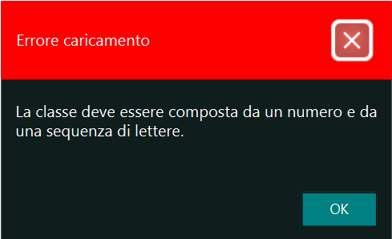<br>

<a id="operazioni-di-inizio-anno"></a>	
	
## V. OPERAZIONI DI INIZIO ANNO
### a. Passaggio di classe: <br>

Questa funzione permettere, all'inizio di un anno scolastico, di eseguire il *trasferimento* da una classe alla successiva. Ad esempio, all’inizio dell’anno scolastico, gli studenti della classe 1A dovranno essere trasferiti nella classe 2A, gli studenti della 2A dovranno essere trasferiti nella classe 3A e così via.
<p align="center">
 <br>

Nella schermata viene visualizzata la lista di tutti i gruppi classe presenti e nella colonna “**Nuova classe**” viene suggerita la nuova classe.<br>
Ad esempio, se la “Vecchia Classe” è 1A, nella colonna “Nuova classe” viene suggerita 2A. <br>

Nella colonna “**Numero studenti**” è presente il numero di studenti inserito in quel gruppo classe.<br>

Oltre alla classe, è possibile modificare anche la scuola. Questo è utile, ad esempio, nel caso di classi *quinte primarie* che effettueranno il passaggio alla scuola secondaria.<br>

A questo punto per ogni classe si può scegliere il comando da eseguire:
-	**Trasferimento**: il vecchio gruppo diventa il nuovo gruppo, di conseguenza tutti gli studenti saranno trasferiti nel nuovo gruppo (nuova classe);
-	**Non eseguire**: Non effettuo nessuna operazione;
-	**Elimina gruppo e blocca studenti**: Questa operazione verrà effettuata nel momento in cui una nuova classe non si forma o se un ciclo di studi termina. <br>


Attraverso il pulsante “**Inizio trasferimento**” con conseguente conferma, il comando selezionato viene effettuato.<br>
La voce “stato” viene aggiornato sull’avanzamento del comando selezionato per ogni gruppo classe. <br>


### b. Creazione team didattici: <br>
Questa funzione permette di creare il team didattico dell’insegnamento (di Microsoft Teams), cioè un team in cui gli studenti fanno lezione con un determinato insegnante per una determinata materia.<br>
Quando viene creato un team didattico collegato a un gruppo classe, tutti gli studenti vengono automaticamente inseriti come membri di quel team, il docente invece viene inserito come proprietario del team.<br>                                                                                                       
	
<p align="center">

	
Quindi si selezionano dalle liste presenti, il *docente*, il *gruppo* *classe* e la *materia*. Una volta selezionati, premere il pulsante “**Aggiungi abbinamento**”<br>
	<p align="center">
 <br>


Mentre è consentita la selezione di un solo docente per volta, è possibile selezionare più gruppi classe e più materie, tenendo premuto il tasto ctrl. In tal caso, saranno inserite nella lista tutte le combinazioni valide di docente - gruppo classe - materia. In tal caso, è possibile rimuovere eventuali combinazioni indesiderate.

Si può eliminare un abbinamento dalla lista attraverso il pulsante “**Elimina**” nella colonna del team selezionato.<br>
	
Si può aggiungere una nuova materia inserendola nell’apposito campo, e cliccando sul pulsante “**+**” verrà inserita nella lista delle materie.<br>

Una volta selezionati docenti, materie e gruppi classe si può procedere con la creazione attraverso il pulsante “**Conferma** e **crea**”. Attendere qualche secondo.<br>
<p align="center">
 <br>


La voce “*stato*” aggiorna l'utente sull’avanzamento della creazione del team.<br>
Attendere il completamento dell’operazione. Quando l’operazione è stata completata, al team sono stati aggiunti tutti i membri, lo stato risulta “*OK*”.<br>
	
Attraverso il pulsante “**Pulisci lista**” è possibile pulire la lista da tutti gli abbinamenti e ripartire con la creazione dei team.<br>
	
>NOTE:<br>
Il docente deve avere una licenza altrimenti non può essere impostato come proprietario del team.                                   
È possibile selezionare un solo docente alla volta.

